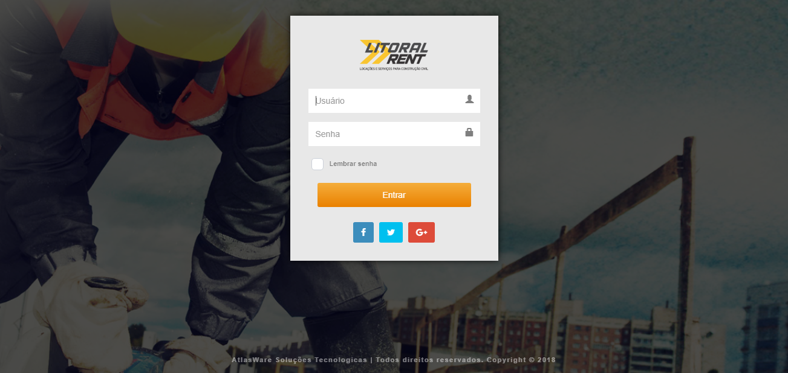
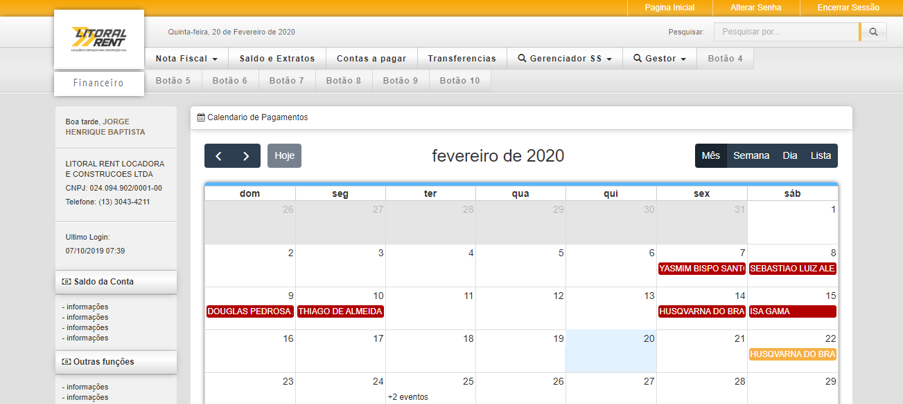
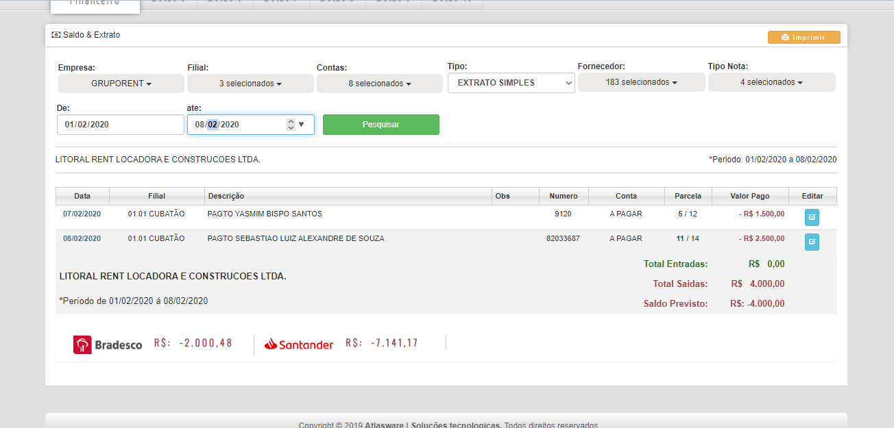
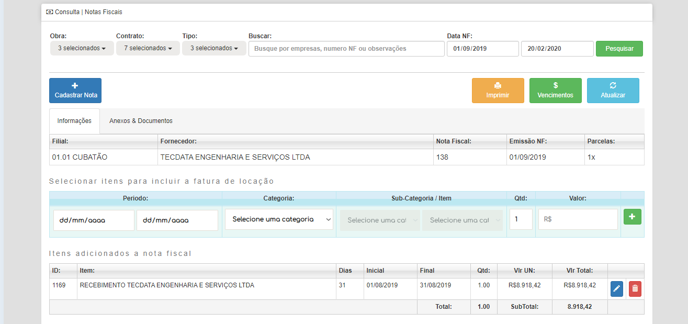

# Sistema Financeiro - AtlasWare
> Projeto de um sistema financeiro para uma locadora de equipamentos da baixada santista, controle de notas fiscais da empresa e contas a pagar

_- Tela de acesso via usuario e senha_

_- Dashboard principal, com calendario de contas em aberto do mês referente_

_- Relatorio de contas a pagar com saldo das contas do banco da empresa_

_- Tela de lançamento dos itens da nota fiscal e anexo de documentos_

Projeto realizado com intuito de suprir as necessidades de uma locadora de equipamentos, com controle de cadastro e consulta de notas fiscais, anexo de boletos, contas pendentes e empresas, ele visa controlar todas as contas da empresa, foi desenvolvido dois modulos separados um para controle financeiro e outro para controle de equipamentos, no futuro a ideia era juntar os dois.

Foi descontinuado, já que a empresa interessada no projeto não deu continuidade no pagamento dele.

## Envolvido no desenvolvimento

Jorge Henrique – [@LinkedIn](https://www.linkedin.com/in/jorge-henrique-baptista/) – jorgehenrique@live.com

The MIT License (MIT)

Copyright (c) 2019 atlasware
